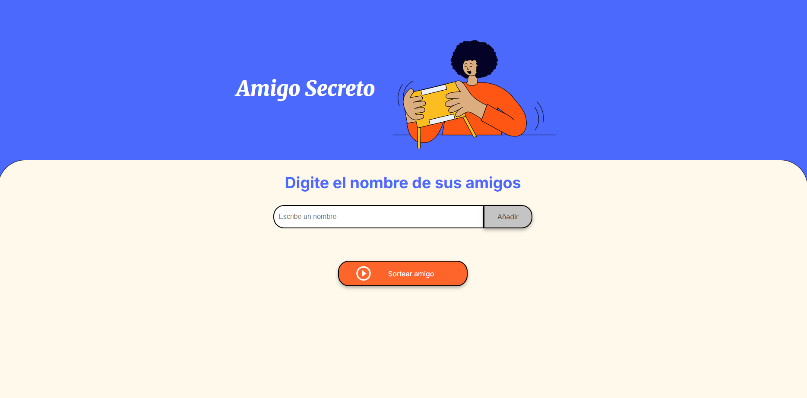
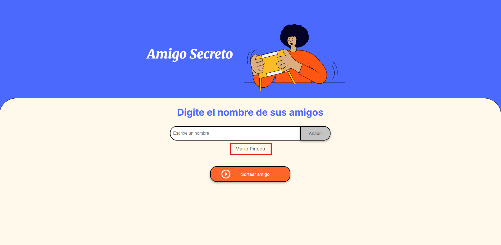
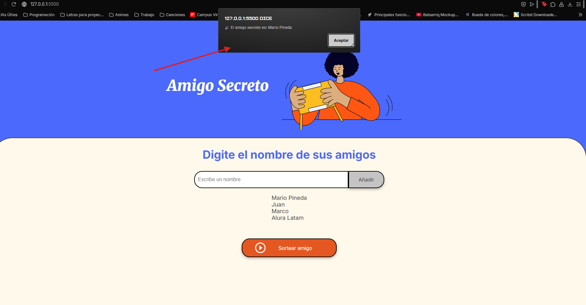
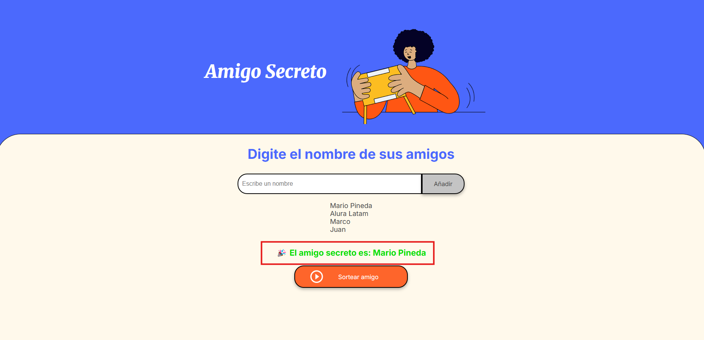

# JuegoAmigoSecreto


# 🎁 Amigo Secreto

Aplicación web simple y divertida para jugar al clásico **Amigo Secreto**.  
Permite ingresar nombres de amigos, mostrarlos en una lista y sortear uno al azar.  



---

## 🚀 Funcionalidades

✅ Ingresar nombres de amigos.  
✅ Mostrar la lista actualizada en pantalla.  
✅ Sortear un amigo secreto aleatoriamente.  
✅ Mostrar el resultado en pantalla y en una alerta emergente.  

---

## 🖥️ Tecnologías utilizadas

- **HTML5**
- **CSS3**
- **JavaScript** (DOM, arrays, eventos)
- **Google Fonts** para la tipografía

---

## 📸 Vista previa

Ejemplo de funcionamiento:

1. Escribe un nombre en el campo de texto.

3. Presiona **"Añadir"** para guardarlo en la lista.
 
5. Cuando todos estén ingresados, presiona **"Sortear amigo"**.
   
7. 🎉 ¡Listo! Aparecerá el amigo secreto seleccionado al azar.
 

---

## 📂 Estructura del proyecto

```plaintext
📁 proyecto-amigo-secreto
│── 📁 assets              # Imágenes y recursos
│── 📄 index.html          # Estructura principal
│── 📄 style.css           # Estilos del proyecto
│── 📄 app.js              # Lógica en JavaScript
│── 📄 README.md           # Documentación del proyecto
